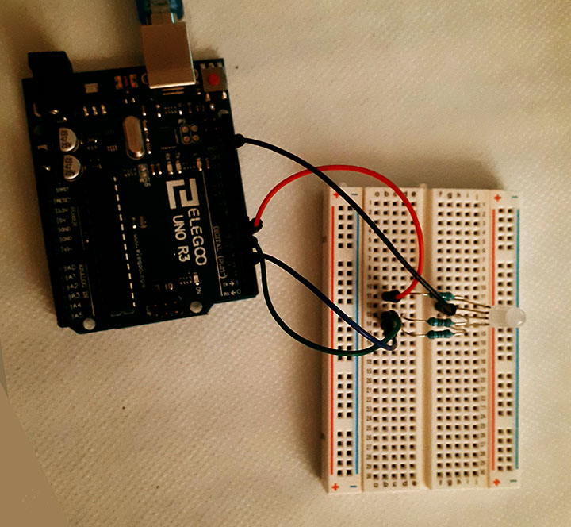
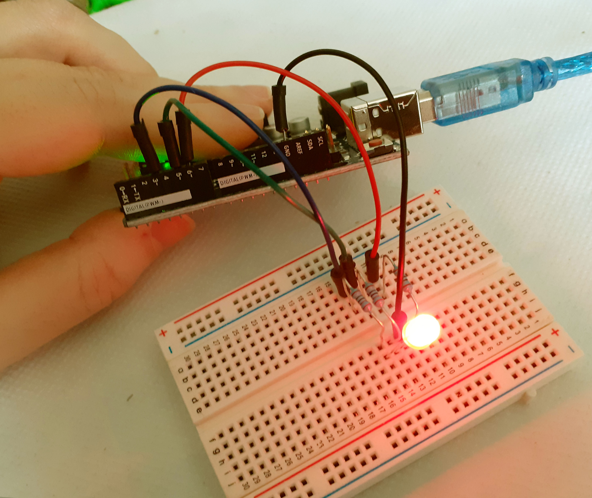

# All colors fading light

## Creative Effect

When the light is set against a white background the fading colours give a surreal effect of light and shadows. The frequency of the colors can be varied, also the range of colors. 

## Description

Cycle through all 255 intermediary colors, starting from Red, then fade to Green, then fade to Blue, and finally to Red again.

## Components

- Arduino Uno
- Breadboard
- Male to Male jumper wires
- 1 RGB Led
- 3 * 220 ohm resistors

## Circuit Scheme

 

 
 

## Video

