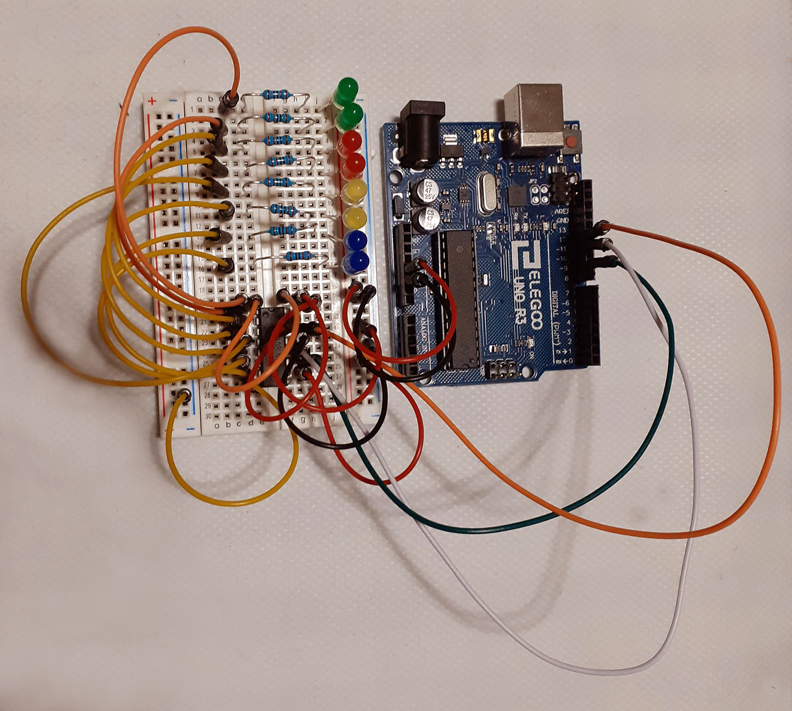

# Colors Creating a Rainbow

## Creative Effect

Create a reflection of a rainbow on a white backgrowd paper by lighting up different color leds one by one.

## Description

Turns on each coloured led one by one, the leds are connected to a chip (Serial to Paralel Coverter).

## Components

- Arduino Uno
- Breadboard
- 74HC595 Serial to Parallel Converter
- M-M jumper wires
- 8 leds ( 2 green, 2 red, 2 yellow, 2 blue)
- 8 * 220 ohm resistors

## Circuit Scheme

 

 
 

## Video

