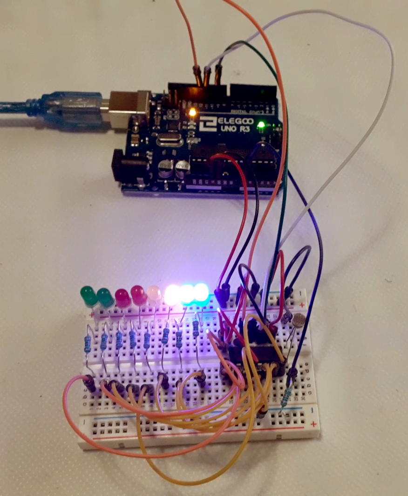

# Light Sensitive Colors

## Creative Effect

When a bright source of light is near the photocell, leds light up gradually, sensitive to the intensity and movement of light.

## Description

Depending on the intensity of the light, the resistance of the photocell changes, determining how many of the leds to light up. 

## Components

- Arduino Uno
- Breadboard
- 74HC595 Serial to Parallel Converter
- M-M jumper wires
- 8 leds ( 2 green, 2 red, 2 yellow, 2 blue)
- 8 * 220 ohm resistors
- 1 * 1k ohm resistor
- 1 Photoresistor

## Circuit Scheme

 

 
 

## Video

