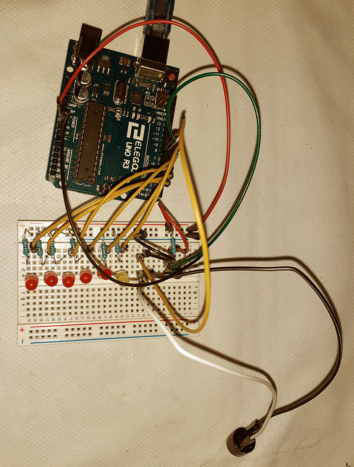

# Movement Sensitive Hourglass

## Creative Effect

Just like an hourglass, the leds light up gradually, simulating the passing of time. 
When the total time has finished, there is also a sound. The timer can be reset by movement 
- turning it over. The time interval can be changed, from seconds, minutes, to hours.

## Description

The leds light one by one, after a set interval of time, until the last led has been lit. 
The tilt switch works like an on/off sensor, detecting orientation, and resets the leds and 
the timer when moved.
 

## Components

- Arduino Uno
- Breadboard
- M-M jumper wires
- 6 leds
- 6 * 220 ohm resistors
- 1 * 10 kilohm resistor
- 1 piezo
- 1 tilt switch

## Circuit Scheme

 

 
 

## Video

