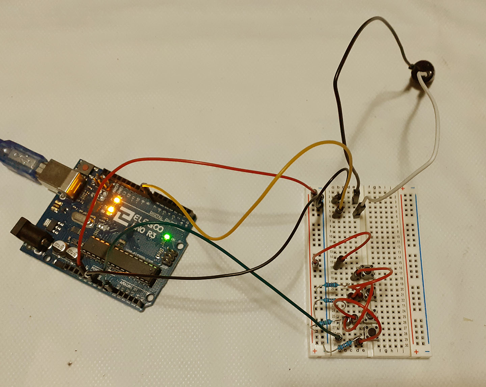

# Keyboard Instrument

## Creative Effect

The push-buttons are like keyboard instruments, they have different frequency notes when they 
are pressed. You can also press multiple buttons at the same time to get a sound. 
The notes frequencies and the number of buttons can be varied.

## Description

The switches are digital inputs connected in paralel to a single port - A0. Each switch has a 
different size rezistor, so different voltage levels will pass when pressed. For each voltage 
range there will be different sound frequency playing.
 

## Components

- Arduino Uno
- Breadboard
- M-M jumper wires
- 1 * 220 ohm resistors
- 2 * 10 kilohm resistor
- 1 * megaohm resistor
- 1 piezo
- 4 push-button switches

## Circuit Scheme

 

 
 

## Video

